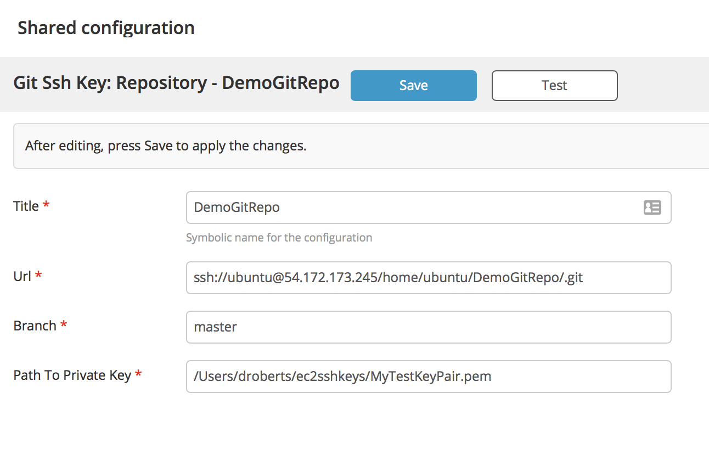

# XL Release Git-via-SSH-key plugin

[![Build Status][xlr-git-via-ssh-key-plugin-travis-image]][xlr-git-via-ssh-key-plugin-travis-url]
[![License: MIT][xlr-git-via-ssh-key-plugin-license-image]][xlr-git-via-ssh-key-plugin-license-url]
![Github All Releases][xlr-git-via-ssh-key-plugin-downloads-image]

[xlr-git-via-ssh-key-plugin-travis-image]: https://travis-ci.org/xebialabs-community/xlr-git-via-ssh-key-plugin.svg?branch=master
[xlr-git-via-ssh-key-plugin-travis-url]: https://travis-ci.org/xebialabs-community/xlr-git-via-ssh-key-plugin
[xlr-git-via-ssh-key-plugin-license-image]: https://img.shields.io/badge/License-MIT-yellow.svg
[xlr-git-via-ssh-key-plugin-license-url]: https://opensource.org/licenses/MIT
[xlr-git-via-ssh-key-plugin-downloads-image]: https://img.shields.io/github/downloads/xebialabs-community/xlr-git-via-ssh-key-plugin/total.svg

## Preface

This document describes the functionality provided by the XL Release Git-via-SSH-key plugin.

See the [XL Release reference manual](https://docs.xebialabs.com/xl-release) for background information on XL Release and release automation concepts.

## Overview

The xlr-git-via-ssh-key-plugin allows XL Release to poll a Git repository for commits via an SSH connection.

## Requirements

* XL Release 7.1+

## Installation

* Place the JAR file (found on the Release tab above) in the `SERVER_HOME/plugins` directory. 

## Usage

* Configure a repo on the Shared Configuration panel.

* Configure a trigger using this repo on your release template.

## Reference

http://www.codeaffine.com/2014/12/09/jgit-authentication/

